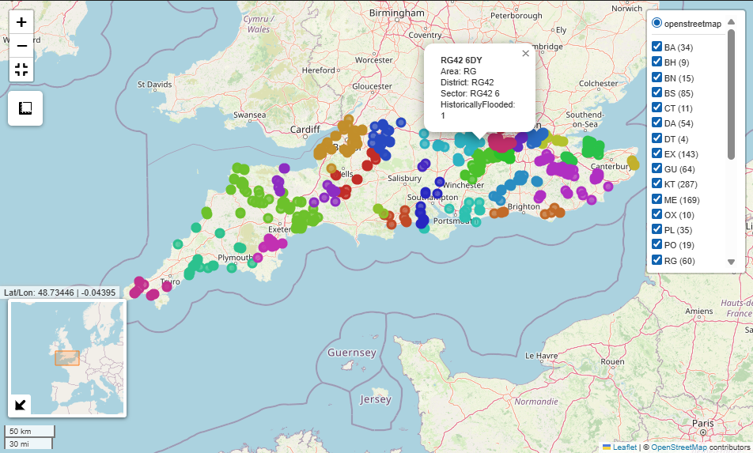
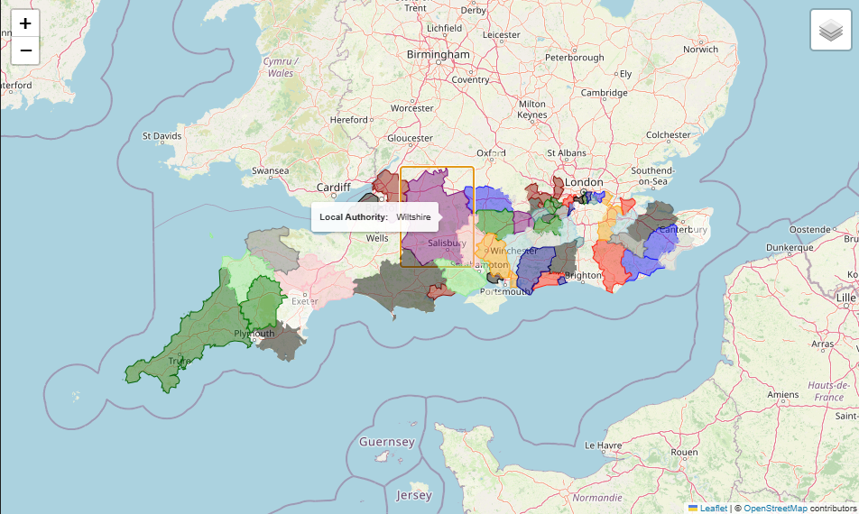
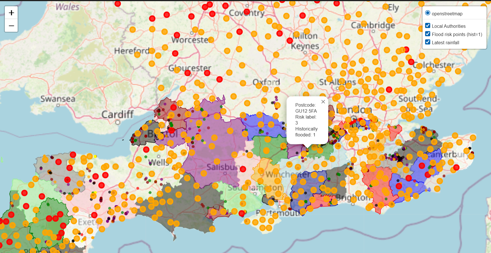

## 项目说明（中文）

本文件前半部分为中文概述；自下方「英文说明原文」标题起，为仓库既有英文说明全文。

### 项目简介

**Exe Software 洪水风险预测工具**面向英格兰地区的邮编或地理坐标，对洪水风险与中位房价进行建模与可视化。本 README 说明软件架构与使用流程，并对应说明 `flood_tool` 包中的功能。

### 核心功能概要

1. **七级洪水概率分类**：基于标注样本，将英格兰邮编划分到七档洪水概率等级。  
2. **邮编中位房价回归**：根据训练样本预测某邮编的中位房价。  
3. **历史洪水二分类**：预测该邮编是否曾发生历史洪水。  
4. **地方行政区与洪水风险**：输入任意经纬度，返回预测的地方行政区（Local Authority）及该处洪水风险。  
5. **可视化**：交互式地图展示数据与预测结果。

另含：AI 工具使用说明（详见 `references.md`）、仓库目录结构、`flood_tool` 的安装步骤、`tool.py` 统一接口（分类、回归、坐标转换、清洗与辅助功能）、测试命令与延伸阅读等。

# Exe Software Flood Risk Prediction tool

This README.md provides a detailed description of the software architecture and operational workflow, and it formally documents the functionality contained within the flood_tool package.

### Key Requirements of Core Functionality
 
This repository contains tools to model and visualise flood risk and housing prices for postcodes/locations in England. The core functionality implemented in this project is summarized below, together with usage instructions, data format expectations, and example commands.
 
1. **Seven‑class flood probability classifier**
   - Classifies postcodes in England into a seven-class flood probability scale using provided labelled samples.
2. **Median house price regression**
   - Predicts the median house price for a postcode in England from sampled training data.
3. **Historic flooding classifier**
   - Binary classifier which predicts whether a postcode has experienced historic flooding from provided labelled samples.
4. **Local Authority & Flood Risk**
   - Accepts an arbitrary geographic location (latitude/longitude). Returns a predicted Local Authority and predicted flood risk for that location.
5. **Visualization**
   - Interactive map with that plots the data and predictions.






### AI usage
We leveraged multiple AI tools during this project’s development, including Google Gemini (Version 2.5 Pro, and 3) , MS Copilot, Google and ChatGPT (Version 4.0 and 5.1). For detailed use cases and outputs of these tools, please refer to ```reference.md```.

### Repository Structure

The main code for the flood tool is in the `flood_tool` directory. This includes directories for data, prediction models, and visualization.

This package contains all core components of the project, including the prediction models,
preprocessed training data, reporting outputs, and visualisation utilities.

- ```models``` — contains all machine-learning and rule-based models used in the tool,
including flood-risk classifiers, house-price predictors, and location-based models.

- ```reports``` — stores testing and evaluation outputs for selected models, including
cross-validation results for the historic flooding classifier and the seven-class model.

- ```resources/preprocessed_data``` — contains preprocessed and cleaned datasets used
during model training. These files represent the final inputs to the machine-learning
pipelines and are not modified at runtime.

- ```html``` — an automatically generated HTML version of the full API documentation,
allowing users to browse all available functions and classes in a web-friendly format.

- ```images``` — output figures and visualisations generated from the tool, including
risk maps, spatial plots, and evaluation graphics.

Documentation can be found in the `docs` directory, and example Jupyter notebooks demonstrating the use of the tool are in the `notebooks` directory.

### Software Installation Guide

Follow these steps to set up the flood-tool environment and install its dependencies using the provided pyproject.toml file.

#### Prerequisites

Python 3.13 or higher: The project relies on Python 3.13+ to ensure compatibility with all libraries (e.g., geopandas, scikit-learn).

Git: Required to clone the project repository.

#### Installation Steps

##### 1. Clone the Project Repository

First, clone the repository to your local machine:

```bash
git clone https://github.com/ese-ada-lovelace-2025/acds-deluge-exe.git
cd ads-deluge
```
##### 2. Create a Virtual Environment

To avoid dependency conflicts, create and activate a virtual environment:

- On Windows:

```bash
python -m venv [your_venv_name]
venv\Scripts\activate
```

- On macOS/Linux:

```bash
python3 -m venv venv
source venv/bin/activate
```

##### 3. Install Core Dependencies via pyproject.toml

The ```pyproject.toml``` file defines all required dependencies (e.g., ```numpy```, ```pandas```, ```geopandas```, ```xgboost```). Install them with:

```bash
pip install .
```

This command reads the dependencies section in ```pyproject.toml``` and installs all necessary libraries.

##### 4. Verify Installation

To confirm the installation, run the command-line interface:

```bash
flood-tool --help
```

If a list of commands and options appears, the installation was successful.

### User Instructions

The ⁠ tool.py ⁠ file provides a unified interface for *Flood-Risk Classification* (Seven Class Flood Probability), *Historic Flooding Prediction*, *Median House Price Prediction, and **Arbitrary Location Analysis*. 

All functions accept either postcodes or geographic coordinates, and all *preprocessing* is handled internally.

#### 1. Flood-Risk Classification (Seven-Class Model)

##### *Postcode-based prediction*

```bash
tool.predict_flood_class_from_postcode(postcodes, model="seven_class_tool")
```

Outputs a seven-level flood-risk label (1–7) for each postcode.

##### *OSGB36 coordinate prediction*

```bash
tool.predict_flood_class_from_OSGB36_location(eastings, northings)
```

Coordinates are matched to the nearest postcode via a KNN spatial search.

##### *WGS84 coordinate prediction*

```bash
tool.predict_flood_class_from_WGS84_locations(longitudes, latitudes)
```

GPS coordinates are converted to OSGB36 before classification.

#### 2. Historic Flooding Classification

```bash
tool.predict_historic_flooding(postcodes, model="historic_rf")
```

Returns a binary prediction indicating

whether each postcode has experienced historic flooding.

#### 3. Local Authority Prediction

Supports both:

- Modal local-authority model

- KNN geographic nearest-authority model

```bash
tool.predict_local_authority(eastings, northings, model="knn")
```

#### 4. House-Price Prediction

```bash
tool.predict_median_house_price(postcodes, model="house_prices_xgb")
```

Predicts median house prices using an XGBoost regressor with preprocessed sector-level features.

#### 5. Annual Flood-Risk Estimation
Human life risk

```bash
tool.estimate_annual_human_flood_risk(postcodes)
```

Economic property risk

```bash
tool.estimate_annual_economic_flood_risk(postcodes)
```

Estimates annual expected loss using predicted risk levels and household/property data.

### 6. Geospatial Conversion
Postcode → OSGB36 

```bash
tool.lookup_easting_northing(postcodes)
```

Postcode → Latitude/Longitude

```bash
tool.lookup_lat_long(postcodes)
```

Postcode → district & sector

```bash
tool.get_postcode_district_sector(postcodes)
```

Attach coordinates to station datasets

```bash
tool.get_station_coordinates(df)
```

#### 7. Data Cleaning Utilities
IQR outlier capping

```bash
tool.handle_outliers_iqr(df, ["col1", "col2"])
```

Missing-value imputation

Supports:

- ⁠"postcode" median/mode

- ⁠"knn" imputation

- ⁠"constant" imputation

```bash
tool.impute_missing_values(df, method="postcode")
```

District-level property age imputation

```bash
tool.impute_district_property_age(df)
```

#### 8. Additional Features
High-risk postcode filtering

```bash
tool.predict_high_risk_near_watercourses(
    watercourse_names=["River Thames"],
    postcodes=None,
    risk_above=4
)
```
 ⁠
Total property value estimation

```bash
tool.estimate_total_value(postcodes)
```

### Testing

The flood-tool includes tests focused on validating its core scoring-related functionality. To execute these tests (which verify the correctness of the tool’s scoring workflows), run the following command directly from the project’s root directory:

```bash
pytest scoring/test_scorable.py -v
```

This command checks key scoring logic (e.g., model output validation, result accuracy) to ensure the tool operates as intended.

### Reading list

- [Stack Exchange. n.d. stackoverflow] (https://stackoverflow.com/questions) 
- [NumPy. n.d. NumPy Documentation] (https://numpy.org/doc/)
- [Python Software Foundation. n.d. Python Documentation] (https://docs.python.org/3/index.html)
- [The Matplotlib Development Team. n.d. Matplotlib Documentation] (https://matplotlib.org/stable/)
- [Scikit Development Team. n.d. Scikit Learn Documentation] (https://scikit-learn.org/stable/)
- [XGBoost Development Team. n.d. XGBoost Documentation] (https://xgboost.readthedocs.io/en/stable/)
- [folium documentation] (https://python-visualization.github.io/folium/latest/user_guide.html)


